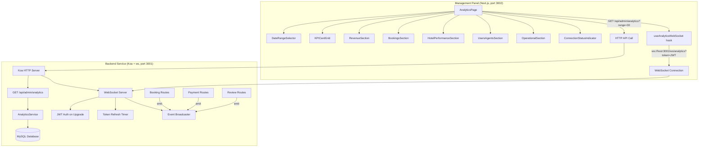

# Design Document: Admin Analytics Dashboard

## Overview

The Admin Analytics Dashboard replaces the placeholder `/admin/analytics` page in the management panel with a comprehensive, real-time data dashboard. It aggregates booking, revenue, hotel, user, and review data from the MySQL database and presents it through interactive recharts visualizations and KPI summary cards.

The system has two main parts:

1. **Backend**: A single `GET /api/admin/analytics` endpoint on the Koa service (port 3001) that returns all dashboard data in one call, plus a WebSocket server (using the `ws` library) running on the same HTTP server for pushing incremental deltas when bookings, payments, or reviews change.

2. **Frontend**: A Next.js page at `/admin/analytics` in the management panel (port 3002) with section-based layout, recharts visualizations, KPI cards, date range filtering, and a custom `useAnalyticsWebSocket` hook that maintains a persistent connection, merges incremental deltas into local state, and handles reconnection with exponential backoff.

### Key Design Decisions

- **Single API endpoint**: All analytics data is returned in one `GET /api/admin/analytics?range=30` call to minimize network requests and simplify frontend data fetching. The response is structured into sections (revenue, bookings, hotels, users, operational) so the frontend can render each section independently.
- **`ws` over Socket.IO**: The `ws` library is lightweight and sufficient for server-to-client push. No need for Socket.IO's fallback transports or rooms — all connected admin clients receive the same broadcast events.
- **JWT in query param for WebSocket**: WebSocket connections don't support custom headers in the browser API, so the JWT token is passed as a query parameter during the upgrade handshake. The server validates it before completing the upgrade.
- **Server-side token refresh**: For TV display scenarios where the dashboard runs unattended, the WebSocket server monitors token expiry and pushes a refreshed token to the client before the current one expires.
- **Incremental deltas**: WebSocket events carry small delta payloads (e.g., +1 booking count, +£150 revenue) that the frontend merges into existing state, avoiding full re-fetches on every change.

## Architecture



### Data Flow

1. **Initial load**: Dashboard mounts → calls `GET /api/admin/analytics?range=30` → renders all sections with returned data → establishes WebSocket connection.
2. **Date range change**: User selects new range → calls `GET /api/admin/analytics?range=7|30|90` → re-renders all sections with new data (shows loading overlay without clearing existing data).
3. **Real-time update**: Backend processes a booking/payment/review → emits event to `AnalyticsEventEmitter` → WebSocket server broadcasts delta to all connected clients → frontend merges delta into state → affected charts/KPIs re-render.
4. **Reconnection**: WebSocket disconnects → exponential backoff reconnection → on reconnect, full data refresh via HTTP API to re-sync state.

## Components and Interfaces

### Backend Components

#### 1. AnalyticsService (`service/src/services/admin-analytics.service.ts`)

Central service that aggregates all dashboard data from MySQL.

```typescript
interface AnalyticsQuery {
  range: 7 | 30 | 90;  // days
}

interface AnalyticsResponse {
  revenue: {
    total: number;           // sum of bookings.total where status IN ('CONFIRMED','COMPLETED')
    average: number;         // total / activeBookingCount
    trend: number;           // percentage change vs previous period
    daily: Array<{ date: string; amount: number }>;
    byHotel: Array<{ hotelId: number; hotelName: string; revenue: number }>;  // top 10
    bySource: Array<{ source: string; revenue: number }>;
    brokerFees: number;      // sum of broker_fee for broker bookings
  };
  bookings: {
    total: number;
    conversionRate: number;  // (CONFIRMED+COMPLETED) / total * 100
    averageStayDuration: number;  // nights
    averageLeadTime: number;      // days between created_at and check_in
    byStatus: Record<string, number>;  // { CONFIRMED: 10, COMPLETED: 5, ... }
    bySource: Record<string, number>;  // { DIRECT: 20, BROKER: 5, ... }
    dailyVolume: Array<{ date: string; confirmed: number; completed: number; expired: number }>;
    byPaymentStatus: Record<string, number>;  // { PAID: 10, UNPAID: 3, ... }
    expiredRate: number;     // expired / total * 100
  };
  hotels: {
    performance: Array<{
      hotelId: number;
      hotelName: string;
      totalBookings: number;
      totalRevenue: number;
      averageRating: number;
      totalReviews: number;
    }>;  // top 10 by booking count
    zeroBookingCount: number;
  };
  reviews: {
    ratingDistribution: Record<number, number>;  // { 1: 5, 2: 10, 3: 20, 4: 30, 5: 15 }
    averageRating: number;
  };
  users: {
    byRole: Record<string, number>;  // { CUSTOMER: 100, AGENT: 20, ... }
    totalCount: number;
    topAgents: Array<{ agentId: number; agentName: string; revenue: number }>;  // top 10
  };
  meta: {
    generatedAt: string;  // ISO timestamp
    range: number;        // days
    periodStart: string;  // ISO date
    periodEnd: string;    // ISO date
  };
}

class AnalyticsService {
  constructor(private database: Database) {}
  async getAnalytics(query: AnalyticsQuery): Promise<AnalyticsResponse>;
}
```

**SQL Strategy**: The service runs multiple focused queries in parallel using `Promise.all` to minimize response time. Each query targets a specific section (revenue aggregation, booking counts, hotel stats, etc.) using the existing MySQL tables: `bookings`, `payments`, `reviews`, `users`, `companies` (hotels).

#### 2. WebSocket Server (`service/src/websocket/analytics-ws.server.ts`)

Manages WebSocket connections alongside the Koa HTTP server.

```typescript
import { WebSocketServer, WebSocket } from 'ws';
import http from 'http';

interface AuthenticatedWebSocket extends WebSocket {
  adminUserId: number;
  tokenExp: number;       // token expiry timestamp
  refreshTimer?: NodeJS.Timeout;
}

class AnalyticsWebSocketServer {
  private wss: WebSocketServer;
  private clients: Set<AuthenticatedWebSocket>;

  constructor(server: http.Server) {
    this.wss = new WebSocketServer({ server, path: '/ws/analytics' });
    this.clients = new Set();
    this.setupConnectionHandler();
  }

  // Authenticate on upgrade, reject invalid tokens
  private setupConnectionHandler(): void;

  // Broadcast event to all connected clients
  broadcast(event: AnalyticsEvent): void;

  // Start token refresh timer for a client
  private startTokenRefreshTimer(client: AuthenticatedWebSocket): void;

  // Clean up on client disconnect
  private handleDisconnect(client: AuthenticatedWebSocket): void;
}
```

**Integration with HTTP server**: The `WebSocketServer` is created with the same `http.Server` instance that Koa uses, sharing port 3001. The `path: '/ws/analytics'` option ensures only requests to that path are upgraded to WebSocket.

**Authentication flow**:
1. Client connects to `ws://host:3001/ws/analytics?token=<JWT>`
2. Server extracts token from URL query params in the `connection` event
3. Server calls `adminAuthService.verifyAccessToken(token)`
4. If invalid → close connection with code 4001 and reason "Authentication failed"
5. If valid → store `adminUserId` and `tokenExp` on the socket, add to clients set

**Token refresh**:
1. On connection, calculate time until token expires
2. Set a timer for `(expiry - 5 minutes)` from now
3. When timer fires, generate new tokens via `adminAuthService.generateTokens()`
4. Send `auth:tokenRefreshed` event with new access token
5. Reset timer for the new token's expiry

#### 3. AnalyticsEventEmitter (`service/src/websocket/analytics-events.ts`)

Singleton event emitter that decouples route handlers from WebSocket broadcasting.

```typescript
import { EventEmitter } from 'events';

interface AnalyticsEvent {
  eventType: 'booking:created' | 'booking:statusChanged' | 'payment:received' | 'review:submitted';
  timestamp: string;  // ISO timestamp
  data: BookingCreatedData | BookingStatusChangedData | PaymentReceivedData | ReviewSubmittedData;
  delta: IncrementalDelta;
}

interface BookingCreatedData {
  bookingId: number;
  source: 'DIRECT' | 'BROKER' | 'STAFF_CREATED';
  amount: number;
  status: string;
}

interface BookingStatusChangedData {
  bookingId: number;
  previousStatus: string;
  newStatus: string;
  revenueImpact: number;  // positive if becoming active, negative if cancelled
}

interface PaymentReceivedData {
  paymentId: number;
  bookingId: number;
  amount: number;
}

interface ReviewSubmittedData {
  reviewId: number;
  hotelId: number;
  rating: number;
}

interface IncrementalDelta {
  bookingCountAdjustment?: number;
  revenueAdjustment?: number;
  statusCountAdjustments?: Record<string, number>;  // e.g., { CONFIRMED: +1 }
  sourceCountAdjustments?: Record<string, number>;
  paymentStatusAdjustments?: Record<string, number>;
  ratingAdjustment?: { rating: number; count: number };  // new rating added
}

class AnalyticsEventEmitter extends EventEmitter {
  private static instance: AnalyticsEventEmitter;
  static getInstance(): AnalyticsEventEmitter;

  emitBookingCreated(data: BookingCreatedData): void;
  emitBookingStatusChanged(data: BookingStatusChangedData): void;
  emitPaymentReceived(data: PaymentReceivedData): void;
  emitReviewSubmitted(data: ReviewSubmittedData): void;
}
```

**Event construction**: Each `emit*` method constructs the full `AnalyticsEvent` with computed deltas. For example, `emitBookingCreated` sets `delta.bookingCountAdjustment = +1`, `delta.revenueAdjustment = amount` (if status is active), and `delta.sourceCountAdjustments = { [source]: +1 }`.

**Error handling**: If event construction throws (e.g., missing data), the error is logged and the event is skipped — no malformed data is pushed to clients.

#### 4. Event Emission Points

Events are emitted from existing route handlers in `service/src/routes/admin.routes.ts` and other booking/payment/review routes:

| Trigger | Route | Event |
|---------|-------|-------|
| New booking created | `POST /api/bookings` (or checkout flow) | `booking:created` |
| Booking status change | `POST /api/admin/bookings/:id/cancel`, status update routes | `booking:statusChanged` |
| Payment processed | Stripe webhook / `POST /api/checkout/...` | `payment:received` |
| Review submitted | `POST /api/reviews` (user-facing) | `review:submitted` |

Each emission point wraps the call in a try/catch so failures don't affect the primary operation.

### Frontend Components

#### 5. AnalyticsPage (`management/src/app/admin/analytics/page.tsx`)

Top-level page component. Manages:
- Date range state (default: 30 days)
- Data fetching via `analyticsService.getAnalytics(range)`
- WebSocket connection via `useAnalyticsWebSocket` hook
- Loading/error states
- Layout grid

```typescript
// Page state
const [range, setRange] = useState<7 | 30 | 90>(30);
const [data, setData] = useState<AnalyticsResponse | null>(null);
const [loading, setLoading] = useState(true);
const [error, setError] = useState<string | null>(null);

// WebSocket hook returns connection status and handles delta merging
const { connectionStatus } = useAnalyticsWebSocket(data, setData);
```

#### 6. useAnalyticsWebSocket Hook (`management/src/hooks/useAnalyticsWebSocket.ts`)

Custom React hook managing the WebSocket lifecycle.

```typescript
type ConnectionStatus = 'connected' | 'disconnected' | 'reconnecting';

interface UseAnalyticsWebSocketReturn {
  connectionStatus: ConnectionStatus;
  reconnect: () => void;
}

function useAnalyticsWebSocket(
  data: AnalyticsResponse | null,
  setData: React.Dispatch<React.SetStateAction<AnalyticsResponse | null>>
): UseAnalyticsWebSocketReturn;
```

**Behavior**:
- On mount: reads JWT from `localStorage('admin_token')`, connects to `ws://host:3001/ws/analytics?token=<JWT>`
- On message: parses `AnalyticsEvent`, calls `mergeDelta(currentData, event.delta)` to produce new state
- On `auth:tokenRefreshed`: updates `localStorage('admin_token')` with new token
- On close: starts exponential backoff reconnection (1s → 2s → 4s → ... → 30s cap, max 10 attempts)
- On reconnect: triggers full data refresh via HTTP API
- On unmount: closes connection, clears timers
- If 10 consecutive failures: stops reconnecting, sets status to `'disconnected'`, shows manual reconnect button

#### 7. Delta Merge Function (`management/src/utils/mergeDelta.ts`)

Pure function that applies an `IncrementalDelta` to an existing `AnalyticsResponse`.

```typescript
function mergeDelta(
  current: AnalyticsResponse,
  delta: IncrementalDelta
): AnalyticsResponse;
```

This function creates a new state object (immutable update) by:
- Adding `delta.revenueAdjustment` to `revenue.total`
- Recalculating `revenue.average` from new total and count
- Adjusting `bookings.byStatus` counts from `delta.statusCountAdjustments`
- Adjusting `bookings.bySource` counts from `delta.sourceCountAdjustments`
- Adjusting `bookings.byPaymentStatus` from `delta.paymentStatusAdjustments`
- Recalculating derived metrics (conversion rate, expired rate)
- Adjusting `reviews.ratingDistribution` and recalculating `reviews.averageRating` from `delta.ratingAdjustment`

If any required baseline data is missing (e.g., `current` is null), the function returns `null` to signal a full refresh is needed.

#### 8. Section Components

Each dashboard section is a self-contained component:

| Component | Charts | KPI Cards |
|-----------|--------|-----------|
| `RevenueSection` | Line chart (daily revenue), Horizontal bar (top 10 hotels), Pie/donut (by source) | Total revenue, Average booking value, Broker fees |
| `BookingsSection` | Stacked area (daily volume by status), Pie (status breakdown), Bar (by source) | Total bookings, Conversion rate, Avg stay duration |
| `HotelPerformanceSection` | Bar (top 10 hotels: bookings + rating) | Hotels with zero bookings |
| `UsersAgentsSection` | Horizontal bar (top 10 agents by revenue) | Total users |
| `OperationalSection` | Pie (payment status distribution) | Expired booking rate, Avg lead time |

#### 9. Shared UI Components

- **KPICard**: Displays a metric value, label, and optional trend indicator. Formats GBP values with `£` prefix and 2 decimal places. Trend shows green ↑ for positive, red ↓ for negative percentage change.
- **DateRangeSelector**: Button group with 7d / 30d / 90d options. Active option is highlighted.
- **ConnectionStatusIndicator**: Small badge in the page header showing WebSocket state — green dot for connected, yellow pulsing dot for reconnecting, red dot for disconnected (with manual reconnect button after max failures).
- **SectionSkeleton**: Loading placeholder matching the section layout, shown during initial load and date range changes.

#### 10. analyticsService (`management/src/services/analyticsService.ts`)

Frontend service for the HTTP API call.

```typescript
import { api } from '@/lib/api';

export const analyticsService = {
  async getAnalytics(range: number): Promise<AnalyticsResponse> {
    return api.get(`/api/admin/analytics?range=${range}`);
  },
};
```

Uses the existing `api` client which automatically attaches the JWT token from localStorage.

## Data Models

### Analytics API Response Shape

The single `GET /api/admin/analytics?range=30` endpoint returns the `AnalyticsResponse` interface defined above. All monetary values are in GBP (pence stored in DB, converted to pounds in the service layer if needed — matching existing booking `total` column behavior).

### WebSocket Event Schema

All WebSocket messages conform to this JSON schema:

```json
{
  "eventType": "booking:created | booking:statusChanged | payment:received | review:submitted | auth:tokenRefreshed",
  "timestamp": "2024-01-15T10:30:00.000Z",
  "data": { },
  "delta": {
    "bookingCountAdjustment": 1,
    "revenueAdjustment": 150.00,
    "statusCountAdjustments": { "CONFIRMED": 1 },
    "sourceCountAdjustments": { "DIRECT": 1 },
    "paymentStatusAdjustments": {},
    "ratingAdjustment": null
  }
}
```

The `auth:tokenRefreshed` event has a different shape:

```json
{
  "eventType": "auth:tokenRefreshed",
  "timestamp": "2024-01-15T10:30:00.000Z",
  "data": { "token": "<new-jwt-token>" },
  "delta": null
}
```

### Database Tables Used

No new tables are created. The analytics service queries existing tables:

- **bookings**: `id`, `status`, `total`, `booking_source`, `broker_fee`, `created_at`, `metadata` (contains check-in/check-out dates)
- **payments**: `id`, `booking_id`, `amount`, `status`, `created_at`
- **reviews**: `id`, `company_id` (hotel), `rating`, `status`, `created_at`
- **users**: `id`, `role`, `first_name`, `last_name`
- **companies**: `id`, `name` (used as hotel name)

### Exponential Backoff Parameters

| Parameter | Value |
|-----------|-------|
| Initial delay | 1,000 ms |
| Multiplier | 2× |
| Maximum delay | 30,000 ms |
| Maximum attempts | 10 |
| Formula | `delay = min(1000 * 2^attempt, 30000)` |

## Correctness Properties

*A property is a characteristic or behavior that should hold true across all valid executions of a system — essentially, a formal statement about what the system should do. Properties serve as the bridge between human-readable specifications and machine-verifiable correctness guarantees.*

### Property 1: Revenue aggregation correctness

*For any* set of bookings with mixed statuses and amounts, the analytics service SHALL compute `revenue.total` as the sum of `total` for bookings with status CONFIRMED or COMPLETED, and `revenue.average` as `revenue.total` divided by the count of those bookings (or 0 if count is 0).

**Validates: Requirements 1.1, 1.2, 1.6**

### Property 2: GBP currency formatting

*For any* numeric value (including zero, negative, and large values), the GBP formatting function SHALL produce a string matching the pattern `£X.XX` where X.XX has exactly two decimal places.

**Validates: Requirements 1.3, 1.4, 4.4**

### Property 3: Trend percentage calculation

*For any* pair of current-period and previous-period revenue values (where previous > 0), the trend percentage SHALL equal `((current - previous) / previous) * 100`. When previous is 0 and current > 0, trend SHALL be 100. When both are 0, trend SHALL be 0.

**Validates: Requirements 1.5**

### Property 4: Date-range revenue aggregation

*For any* set of bookings with various `created_at` dates and a given date range, the daily revenue array SHALL contain one entry per day in the range, and the sum of all daily amounts SHALL equal the total revenue for that range.

**Validates: Requirements 2.1**

### Property 5: Top-N hotel revenue ranking

*For any* set of bookings across multiple hotels, the `revenue.byHotel` array SHALL be sorted in descending order by revenue, limited to at most 10 entries, and SHALL exclude hotels with zero active bookings.

**Validates: Requirements 3.1, 3.3**

### Property 6: Revenue by booking source

*For any* set of bookings with mixed sources, the sum of `revenue.bySource` entries SHALL equal `revenue.total`, and `revenue.brokerFees` SHALL equal the sum of `broker_fee` for BROKER bookings with status CONFIRMED or COMPLETED.

**Validates: Requirements 4.1, 4.3**

### Property 7: Booking status metrics

*For any* set of bookings, the sum of all values in `bookings.byStatus` SHALL equal `bookings.total`, `bookings.conversionRate` SHALL equal `(CONFIRMED + COMPLETED) / total * 100`, and `bookings.expiredRate` SHALL equal `EXPIRED / total * 100`.

**Validates: Requirements 5.1, 5.4, 11.1**

### Property 8: Daily booking volume by status

*For any* set of bookings within a date range, the daily volume array SHALL contain one entry per day, and for each day the sum of confirmed + completed + expired counts SHALL equal the total bookings for that day with those statuses.

**Validates: Requirements 6.1**

### Property 9: Booking source counts and stay duration

*For any* set of bookings, the sum of all values in `bookings.bySource` SHALL equal `bookings.total`. The `averageStayDuration` SHALL equal the average of `(checkOut - checkIn)` in days for bookings that have both dates, excluding bookings with missing check-in or check-out.

**Validates: Requirements 7.1, 7.3, 7.4**

### Property 10: Hotel performance aggregation

*For any* set of hotels, bookings, and reviews, each entry in `hotels.performance` SHALL have `totalBookings` equal to the count of bookings for that hotel, `totalRevenue` equal to the sum of active booking totals, `averageRating` equal to the mean of review ratings, and `totalReviews` equal to the review count. `hotels.zeroBookingCount` SHALL equal the count of hotels with zero bookings.

**Validates: Requirements 8.1, 8.3**

### Property 11: Review metrics

*For any* set of reviews with ratings 1–5, the sum of all values in `reviews.ratingDistribution` SHALL equal the total review count, and `reviews.averageRating` SHALL equal the mean of all ratings rounded to one decimal place.

**Validates: Requirements 9.1, 9.3**

### Property 12: User counts by role and top agents

*For any* set of users, the sum of all values in `users.byRole` SHALL equal `users.totalCount`. The `users.topAgents` array SHALL be sorted in descending order by revenue and limited to at most 10 entries.

**Validates: Requirements 10.1, 10.3**

### Property 13: Payment status distribution and lead time

*For any* set of bookings with payment statuses, the sum of all values in `bookings.byPaymentStatus` SHALL equal the total number of payments. The `averageLeadTime` SHALL equal the average of `(checkIn - createdAt)` in days for active bookings that have a check-in date.

**Validates: Requirements 11.3, 11.5**

### Property 14: WebSocket authentication

*For any* JWT token string, the WebSocket server SHALL accept the connection if and only if `adminAuthService.verifyAccessToken(token)` returns a valid payload. Invalid, expired, or missing tokens SHALL result in connection rejection with close code 4001.

**Validates: Requirements 14.4, 14.5**

### Property 15: Token refresh timing

*For any* JWT token with an expiry timestamp, the WebSocket server SHALL schedule a token refresh event when the remaining time until expiry is less than or equal to 5 minutes. The refreshed token SHALL be a valid JWT with a new expiry.

**Validates: Requirements 14.6**

### Property 16: Exponential backoff delay calculation

*For any* reconnection attempt number `n` (0-indexed), the reconnection delay SHALL equal `min(1000 * 2^n, 30000)` milliseconds.

**Validates: Requirements 15.1**

### Property 17: Analytics event schema conformance

*For any* analytics event of any type (booking:created, booking:statusChanged, payment:received, review:submitted), the event payload SHALL contain fields `eventType` (string), `timestamp` (ISO 8601 string), `data` (object with type-specific required fields), and `delta` (object with numeric adjustment fields). Specifically: booking:created data SHALL include bookingId, source, amount, and status; booking:statusChanged data SHALL include bookingId, previousStatus, newStatus, and revenueImpact; payment:received data SHALL include paymentId, bookingId, and amount; review:submitted data SHALL include reviewId, hotelId, and rating.

**Validates: Requirements 17.1, 17.5, 18.1, 18.2, 18.3, 18.4, 18.5**

### Property 18: Delta merge correctness

*For any* valid `AnalyticsResponse` state and any valid `IncrementalDelta`, applying `mergeDelta(state, delta)` SHALL produce a new state where `revenue.total` equals the original total plus `delta.revenueAdjustment`, each status count in `bookings.byStatus` equals the original count plus the corresponding adjustment, and all derived metrics (conversion rate, expired rate, average rating) are recalculated consistently from the updated base values.

**Validates: Requirements 17.2**

## Error Handling

### Backend

| Scenario | Handling |
|----------|----------|
| Database query failure in analytics endpoint | Return 500 with `{ success: false, error: 'Failed to load analytics data' }`. Log full error. |
| Invalid `range` query parameter | Default to 30 days. Accept only 7, 30, 90. |
| WebSocket connection without token | Reject with close code 4001, reason "Authentication required". |
| WebSocket connection with invalid/expired token | Reject with close code 4001, reason "Authentication failed". |
| Error constructing analytics event | Log error, skip event. Do not push malformed data. Primary operation (booking/payment/review) is not affected. |
| Token refresh failure | Log error, do not send refresh event. Client will eventually disconnect and reconnect with a fresh token. |
| Database connection lost during analytics query | Return 500. The existing connection pool handles reconnection. |

### Frontend

| Scenario | Handling |
|----------|----------|
| Analytics API returns error | Show error banner with retry button. Keep any previously loaded data visible. |
| Analytics API timeout | Show error banner with retry button. |
| WebSocket connection lost | Update ConnectionStatusIndicator to "disconnecting". Start exponential backoff reconnection. |
| WebSocket reconnection succeeds | Update indicator to "connected". Trigger full data refresh. |
| 10 consecutive reconnection failures | Stop reconnecting. Show persistent error with manual reconnect button. |
| Received delta with null baseline data | Trigger full data refresh instead of merge. |
| Received `auth:tokenRefreshed` event | Update `localStorage('admin_token')` with new token. |
| Invalid JSON in WebSocket message | Log warning, ignore message. |

## Testing Strategy

### Property-Based Tests (fast-check)

Property-based testing is appropriate for this feature because the analytics service contains pure aggregation functions with clear input/output behavior, the delta merge function is a pure transformation, and the event construction and backoff calculation are deterministic functions with wide input spaces.

**Library**: `fast-check` (already installed in both `service` and `management` devDependencies)

**Configuration**: Minimum 100 iterations per property test. Each test tagged with:
```
Feature: admin-analytics-dashboard, Property {N}: {property_text}
```

**Backend property tests** (`service/src/__tests__/admin-analytics.service.test.ts`):
- Properties 1, 3, 4, 5, 6, 7, 8, 9, 10, 11, 12, 13: Test analytics aggregation logic with generated booking/review/user data sets
- Properties 14, 15: Test WebSocket auth and token refresh logic with generated JWT tokens
- Property 17: Test event construction with generated event data

**Frontend property tests** (`management/src/__tests__/analytics-merge.test.ts`):
- Property 2: Test GBP formatting with generated numeric values
- Property 16: Test exponential backoff calculation with generated attempt numbers
- Property 18: Test delta merge function with generated states and deltas

### Unit Tests (Jest)

- **AnalyticsService**: Example-based tests with known data sets verifying specific aggregation results
- **WebSocket server**: Example-based tests for connection lifecycle (connect, auth, disconnect)
- **Event emission**: Example-based tests verifying events are emitted from route handlers
- **Frontend components**: Example-based tests for rendering KPI cards, charts, loading states, error states
- **ConnectionStatusIndicator**: Example-based tests for each connection state
- **DateRangeSelector**: Example-based tests for option selection and callback

### Integration Tests

- **Full API flow**: Call `GET /api/admin/analytics` with seeded database, verify response shape and values
- **WebSocket flow**: Connect, receive events, verify delta format
- **Date range filtering**: Verify different ranges return correctly scoped data

### Edge Case Tests

- Zero bookings in database → all metrics return 0 or empty arrays
- All bookings have same status → conversion rate is 100% or 0%
- Bookings with missing metadata (no check-in/check-out) → excluded from stay duration
- Very large numbers → GBP formatting handles thousands separators
- Concurrent WebSocket connections → all receive broadcast events
- Token expires during active connection → refresh event is sent before expiry
