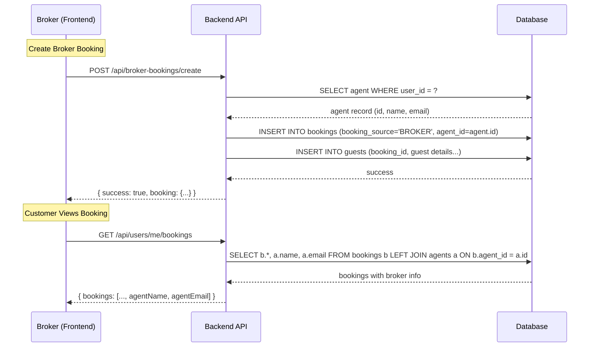

# Design Document: Broker Bookings Tab

## Overview

This design adds a "Broker" tab to the Management Suite, enabling broker/agent users to create bookings on behalf of customers at any active hotel and view all their broker-created bookings. The feature reuses the existing `CreateBookingModal` with a new `mode` prop to control hotel selection behavior, and introduces a new `DashboardBrokerContent` component modeled after `DashboardBookingsContent`. On the backend, the existing `GET /api/users/me/broker-bookings` endpoint is already in place; the main API change is extending `GET /api/users/me/bookings` to include broker attribution info for customer-facing views.

### Design Decisions

1. **Reuse over duplication**: The `CreateBookingModal` is extended with a `mode` prop (`'hotel' | 'broker'`) rather than creating a separate modal. This keeps booking creation logic centralized.
2. **Single booking record**: Broker bookings use the same `bookings` table row as all other bookings. Cancellation by any party (broker, hotel, customer) updates the same record, so status is inherently consistent across all views.
3. **Existing endpoint leverage**: The `GET /api/users/me/broker-bookings` endpoint already exists and filters by `agent_id`. No new listing endpoint is needed.
4. **Minimal API surface change**: Only `GET /api/users/me/bookings` needs modification (adding a JOIN to fetch broker name/email). All other endpoints remain untouched.

## Architecture

```mermaid
graph TD
    subgraph Frontend
        MPL[ManagementPageLayout] --> HB[Hotel Bookings Tab]
        MPL --> BT[Broker Tab - NEW]
        MPL --> HT[Hotels Tab]
        MPL --> PT[Payments Tab]

        BT --> DBC[DashboardBrokerContent - NEW]
        DBC --> CBM[CreateBookingModal - Extended]
        HB --> DBK[DashboardBookingsContent]
        DBK --> CBM

        DBC -->|mode='broker'| CBM
        DBK -->|mode='hotel'| CBM
    end

    subgraph Backend
        DBC -->|GET| BBA[/api/users/me/broker-bookings/]
        DBC -->|POST| SBC[/api/broker-bookings/create/]
        DBC -->|PUT| CBC[/api/hotels/bookings/:id/cancel/]
        CBM -->|GET broker mode| AH[/api/hotels/active/]
        CBM -->|GET hotel mode| UH[/api/hotels/listings/]
        MBP[MyBookingsPage] -->|GET| UMB[/api/users/me/bookings/ - Extended]
    end

    subgraph Database
        BKT[bookings table]
        GT[guests table]
        AT[agents table]
        HoT[hotels table]
    end

    SBC --> BKT
    SBC --> GT
    BBA --> BKT
    BBA --> AT
    UMB --> BKT
    UMB --> AT
    AH --> HoT
```

## Components and Interfaces

### Frontend Components

#### 1. ManagementPageLayout (Modified)

Add the "Broker" tab to the `menuItems` array, positioned between "Hotel Bookings" and "Hotels".

```typescript
// Addition to menuItems array
const menuItems = [
  { label: "Hotel Bookings", href: "/dashboard/listings/bookings", icon: "ri-calendar-check-line" },
  { label: "Broker", href: "/dashboard/listings/broker", icon: "ri-user-shared-line" },  // NEW
  { label: "Hotels", href: "/dashboard/listings", icon: "ri-building-line" },
  { label: "Payments", href: "/payments", icon: "ri-wallet-line" },
];
```

#### 2. DashboardBrokerContent (New)

New component at `frontend/src/components/Dashboard/DashboardBrokerContent.tsx`. Modeled after `DashboardBookingsContent` but fetches from the broker-bookings endpoint.

```typescript
interface DashboardBrokerContentProps {}

// State
interface BrokerContentState {
  bookings: BrokerBooking[];
  loading: boolean;
  error: string | null;
  filterStatus: string;
  searchGuest: string;
  showCreateModal: boolean;
  showCancelConfirm: boolean;
  selectedBooking: BrokerBooking | null;
}

interface BrokerBooking {
  id: string;
  status: string;
  currency: string;
  subtotal: number;
  tax: number;
  total: number;
  paymentStatus: string;
  bookingSource: string;
  hotelName: string;
  guestName: string;
  guestEmail: string;
  checkIn: string;
  checkOut: string;
  nights: number;
  createdAt: string;
}
```

Key behaviors:
- Fetches from `GET /api/users/me/broker-bookings` on mount
- Displays loading spinner while fetching
- Shows error message on fetch failure
- Shows empty state when no bookings exist (or no agent record)
- "Create Booking" button opens `CreateBookingModal` with `mode="broker"`
- Cancellation shows confirmation prompt, then calls `PUT /api/hotels/bookings/:id/cancel`
- Refreshes list after successful booking creation or cancellation

#### 3. CreateBookingModal (Extended)

Add a `mode` prop to control behavior:

```typescript
interface CreateBookingModalProps {
  isOpen: boolean;
  onClose: () => void;
  hotelId: string;
  onBookingCreated: (booking: any) => void;
  mode?: 'hotel' | 'broker';  // NEW — defaults to 'hotel'
}
```

Mode-dependent behavior:

| Behavior | `mode='hotel'` (default) | `mode='broker'` |
|---|---|---|
| Hotel dropdown source | `GET /api/hotels/listings` (owned hotels) | `GET /api/hotels/active` (all active hotels) |
| Hotel dropdown visibility | Hidden when only 1 hotel | Always visible |
| Guest fields | firstName, lastName, email, phone | firstName, lastName, email, phone (required), nationality, passport, DOB (optional) |
| Multi-guest fields | Basic (name, email, phone) | Extended (name, email, phone, nationality, passport, DOB) |
| Broker notes field | Hidden | Visible (optional textarea) |
| Submit endpoint | `POST /api/staff-bookings/create-on-behalf` | `POST /api/broker-bookings/create` |
| booking_source | `'STAFF_CREATED'` | `'BROKER'` |

Extended Guest interface for broker mode:

```typescript
interface BrokerGuest extends Guest {
  nationality?: string;
  passportNumber?: string;
  dateOfBirth?: string;
}
```

#### 4. Broker Page (New)

New page at `frontend/src/app/dashboard/listings/broker/page.tsx`:

```typescript
const DashboardBrokerPage: React.FC = () => (
  <>
    <Navbar />
    <ManagementPageLayout>
      <DashboardBrokerContent />
    </ManagementPageLayout>
    <Footer />
  </>
);
```

#### 5. BookingDetailPanel (Modified)

Add broker attribution display in the customer's My Bookings detail view:

```typescript
// When booking.bookingSource === 'BROKER' && booking.agentName
<div className={styles.brokerSection}>
  <h4>Booked by</h4>
  <p>{booking.agentName}</p>
  <p>{booking.agentEmail}</p>
</div>
```

This section is conditionally rendered only when `bookingSource === 'BROKER'` and `agentId` is present.

### Backend Endpoints

#### 1. POST /api/broker-bookings/create (New)

Creates a broker booking with proper attribution. Reuses logic from `staff-booking.routes.ts` but sets `booking_source = 'BROKER'` and resolves the broker's `agent_id`.

```typescript
// Request body
interface CreateBrokerBookingRequest {
  hotelId: string;
  checkInDate: string;       // YYYY-MM-DD
  checkOutDate: string;      // YYYY-MM-DD
  numberOfGuests: number;
  rooms: Array<{ roomTypeId: string; quantity: number }>;
  guests: Array<{
    firstName: string;
    lastName: string;
    email: string;
    phone?: string;
    nationality?: string;
    passportNumber?: string;
    dateOfBirth?: string;
    isLead: boolean;
  }>;
  brokerNotes?: string;
  sendPaymentLink: boolean;
}

// Response (201)
interface CreateBrokerBookingResponse {
  success: boolean;
  booking: {
    id: string;
    status: string;
    guestName: string;
    guestEmail: string;
    checkInDate: string;
    checkOutDate: string;
    numberOfGuests: number;
    createdAt: string;
  };
  message: string;
}
```

Logic:
1. Authenticate user, look up their `agents` record by `user_id`
2. If no agent record, return 403
3. Validate required fields (hotelId, dates, rooms, lead guest with name/email/phone)
4. Verify the hotel exists and is active
5. Create booking with `booking_source = 'BROKER'`, `agent_id = agent.id`
6. Insert all guests into `guests` table with `booking_id`, first guest as `is_lead_passenger = true`
7. Store `broker_notes` on the booking record
8. Return success with booking details

#### 2. GET /api/hotels/active (New)

Returns all active hotels in the system for broker hotel selection.

```typescript
// Response
interface ActiveHotelsResponse {
  hotels: Array<{
    id: string;
    name: string;
  }>;
}
```

This is a simple query: `SELECT id, name FROM hotels WHERE status = 'ACTIVE' ORDER BY name`. Requires authentication but no ownership check.

#### 3. GET /api/users/me/bookings (Modified)

Add a LEFT JOIN to the `agents` table to include broker info when `booking_source = 'BROKER'`:

```sql
SELECT
  b.*,
  -- existing fields...
  b.booking_source as bookingSource,
  b.agent_id as agentId,
  a.name as agentName,
  a.email as agentEmail
FROM bookings b
LEFT JOIN hotels h ON h.id = JSON_UNQUOTE(JSON_EXTRACT(b.metadata, '$.hotelId'))
LEFT JOIN agents a ON b.agent_id = a.id  -- NEW JOIN
WHERE b.customer_id = ?
```

The response adds `bookingSource`, `agentId`, `agentName`, and `agentEmail` fields. For non-broker bookings, `agentName` and `agentEmail` will be `null`, preserving backward compatibility.

#### 4. GET /api/users/me/broker-bookings (Existing — No Changes)

Already implemented in `user.routes.ts`. Looks up the user's agent record, then fetches bookings where `agent_id` matches. Returns empty array if no agent record exists.

## Data Models

### Existing Tables (No Schema Changes)

#### bookings table
Relevant columns for this feature:
- `booking_source ENUM('DIRECT','STAFF_CREATED','AGENT','BROKER','API','ADMIN')` — set to `'BROKER'` for broker bookings
- `agent_id VARCHAR(36)` — references `agents.id` for the creating broker
- `broker_notes TEXT` — optional notes from the broker

#### agents table
- `id VARCHAR(36)` — primary key, referenced by `bookings.agent_id`
- `user_id VARCHAR(36)` — links to the broker's user account
- `name VARCHAR(255)` — broker's display name
- `email VARCHAR(255)` — broker's contact email

#### guests table
- `id VARCHAR(36)` — primary key
- `booking_id VARCHAR(36)` — foreign key to `bookings.id`
- `first_name`, `last_name`, `email`, `phone`, `nationality`, `passport_number`, `date_of_birth`
- `is_lead_passenger BOOLEAN` — true for the primary guest

### Data Flow



## Correctness Properties

*A property is a characteristic or behavior that should hold true across all valid executions of a system — essentially, a formal statement about what the system should do. Properties serve as the bridge between human-readable specifications and machine-verifiable correctness guarantees.*

### Property 1: Broker bookings filtered by agent_id

*For any* user with an agent record and *for any* set of bookings in the database with various `agent_id` values, the `GET /api/users/me/broker-bookings` endpoint SHALL return only bookings where `agent_id` matches the user's agent record, and no others.

**Validates: Requirements 2.2, 5.3**

### Property 2: Broker booking attribution

*For any* booking created via the broker flow, the resulting booking record SHALL have `booking_source = 'BROKER'` and `agent_id` equal to the authenticated broker's agent record identifier.

**Validates: Requirements 3.3, 3.4, 5.1, 5.2**

### Property 3: All active hotels available in broker mode

*For any* set of hotels in the database, the broker-mode hotel endpoint SHALL return exactly the set of hotels with active status, regardless of which user owns them.

**Validates: Requirements 3.2, 4.1**

### Property 4: Broker booking display completeness

*For any* broker booking object, the rendered booking list item SHALL contain the hotel name, guest name, check-in date, check-out date, status, payment status, and total amount.

**Validates: Requirements 2.4**

### Property 5: Customer view broker attribution

*For any* booking where `booking_source = 'BROKER'` and `agent_id` is set, the `GET /api/users/me/bookings` response SHALL include the broker's `agentName` and `agentEmail`, and the customer booking detail view SHALL display a "Booked by" section with the broker's name and email.

**Validates: Requirements 6.1, 6.2, 6.3, 6.4**

### Property 6: No broker attribution for non-broker bookings

*For any* booking where `booking_source` is not `'BROKER'` or `agent_id` is null, the customer booking view SHALL NOT render any broker attribution section.

**Validates: Requirements 6.5**

### Property 7: Required field validation for broker bookings

*For any* broker booking submission where the lead guest's first name, last name, email, or phone is missing or empty, the system SHALL reject the submission with a validation error and the booking SHALL NOT be created.

**Validates: Requirements 7.1, 7.2, 7.3**

### Property 8: Guest details persistence round-trip

*For any* broker booking with N guests (each having name, email, phone, and optional nationality/passport/DOB) and optional broker notes, after creation the `guests` table SHALL contain exactly N rows linked to the booking with matching data, the first guest marked as lead passenger, and the `broker_notes` field on the booking record SHALL match the submitted notes.

**Validates: Requirements 7.8, 7.10**

### Property 9: Cancellation status propagation

*For any* broker booking, when the status is set to `'CANCELLED'` (by broker or hotel manager), the booking SHALL appear as `'CANCELLED'` when queried via the broker-bookings endpoint, the hotel-bookings endpoint, and the customer-bookings endpoint.

**Validates: Requirements 8.1, 8.2, 8.3, 8.4, 8.5**

### Property 10: Cancellation metadata persistence

*For any* broker booking cancellation with a provided reason, the booking record SHALL store the cancellation reason and a non-null cancellation timestamp.

**Validates: Requirements 8.7**

### Property 11: Customer bookings include all sources

*For any* customer with bookings of mixed `booking_source` values (DIRECT, STAFF_CREATED, BROKER), the `GET /api/users/me/bookings` endpoint SHALL return all bookings where `customer_id` matches, regardless of `booking_source`.

**Validates: Requirements 9.5**

## Error Handling

| Scenario | Handling |
|---|---|
| User has no agent record and opens Broker tab | API returns empty bookings array; UI shows empty state message |
| Broker-bookings fetch fails (network/server error) | UI shows error banner with retry option |
| Hotel not found or inactive during booking creation | API returns 404; modal shows error message |
| Required guest fields missing | Client-side validation prevents form submission; server-side validation returns 400 |
| Room availability check fails | Modal falls back to basic room types endpoint |
| No rooms available for selected dates | Modal shows "no rooms available" warning, blocks progression |
| Duplicate booking detected | Modal shows warning banner (non-blocking) |
| Booking creation fails (server error) | Modal shows error banner; form state preserved for retry |
| Cancellation fails | Error toast/banner; booking state unchanged |
| Agent record lookup fails during booking creation | API returns 403 with descriptive message |

## Testing Strategy

### Unit Tests
- **ManagementPageLayout**: Verify "Broker" tab is rendered in correct position, active state matches route
- **DashboardBrokerContent**: Test loading, error, and empty states; verify fetch is called on mount; verify cancellation confirmation prompt
- **CreateBookingModal (broker mode)**: Test hotel dropdown always visible; extended guest fields rendered; broker notes field present; validation for required fields
- **BookingDetailPanel**: Test broker attribution section renders for broker bookings, hidden for non-broker bookings
- **API endpoint tests**: Test broker-bookings creation with correct attribution, guest persistence, broker notes storage

### Property-Based Tests

Property-based testing applies to this feature for the backend logic (filtering, attribution, persistence round-trips) and validation logic.

**Library**: `fast-check` (already available in the project's test ecosystem via Jest)

**Configuration**: Minimum 100 iterations per property test.

**Tag format**: `Feature: broker-bookings-tab, Property {number}: {property_text}`

Properties to implement:
1. **Property 1** — Generate random bookings with various agent_ids, filter by a specific agent_id, verify only matching bookings returned
2. **Property 2** — Generate random broker booking params, create via broker flow, verify booking_source and agent_id
3. **Property 3** — Generate random hotel sets with mixed statuses, query active hotels endpoint, verify only active hotels returned
4. **Property 5** — Generate random broker bookings, query customer endpoint, verify agentName/agentEmail present
5. **Property 6** — Generate random non-broker bookings, verify no broker attribution in response
6. **Property 7** — Generate random guest data with some required fields missing, verify validation rejects
7. **Property 8** — Generate random guest lists and broker notes, create booking, query guests table, verify round-trip
8. **Property 9** — Generate random broker bookings, cancel, verify status is CANCELLED across all query endpoints
9. **Property 10** — Generate random cancellation reasons, cancel bookings, verify reason and timestamp stored
10. **Property 11** — Generate random bookings with mixed sources for a customer, query customer endpoint, verify all returned

### Integration Tests
- End-to-end flow: broker creates booking → appears in broker list → appears in hotel bookings → customer sees broker info
- Cancellation cascade: broker cancels → verify all three views show CANCELLED
- Existing functionality regression: Hotel Bookings tab, Hotels tab, Payments tab, My Bookings page unchanged
- CreateBookingModal in hotel mode still limits to owned hotels

### Edge Case Tests
- User with no agent record accessing broker tab (empty state)
- Broker creating booking at a hotel they own (should work, treated as broker booking)
- Multiple agents for same user (use first agent record)
- Booking with maximum number of guests (boundary)
- Broker notes with special characters / unicode
