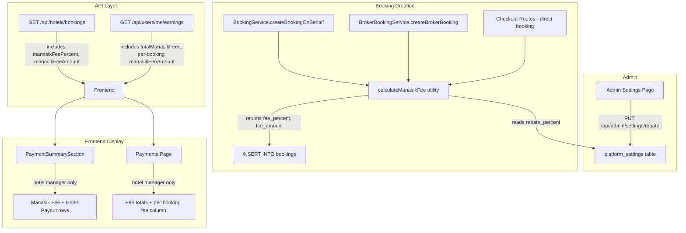

# Design Document: Manasik Fee Rebate

## Overview

This feature adds a platform commission ("Manasik Fee") to every booking in the system. The fee is a configurable percentage of the booking subtotal, stored per-booking at creation time. It is calculated consistently across all three booking paths (staff-created, broker, and direct checkout), persisted in two new database columns, and surfaced in the booking details modal and payments page — but only to hotel managers.

The admin settings page already supports reading and writing the `rebate_percent` value in `platform_settings`. This design focuses on:
1. Adding `manasik_fee_percent` and `manasik_fee_amount` columns to the `bookings` table
2. Injecting fee calculation into all booking creation paths
3. Returning fee data in the hotel bookings API and earnings API
4. Displaying fee line items in the PaymentSummarySection component (hotel managers only)
5. Integrating fee totals into the Payments page (hotel managers only)

### Key Design Decisions

- **Snapshot-at-creation**: The fee percentage active at booking time is stored on the booking record. If the admin later changes the global rate, existing bookings are unaffected. This provides an auditable historical record.
- **Shared utility function**: A single `calculateManasikFee(subtotal, percent)` function is used by all three booking paths to guarantee consistent rounding and validation.
- **Hotel-manager-only visibility**: The Manasik Fee and Hotel Payout line items are gated by a role check. Guests, brokers, and other roles never see these fields in the UI.
- **Backward compatibility**: Legacy bookings without fee columns default to `0.00`, so existing data renders correctly without migration backfill.

## Architecture



The architecture follows the existing patterns in the codebase:
- Database migrations use numbered SQL files in `service/database/migrations/`
- Booking services use `getPool()` for database access
- API routes format `snake_case` DB columns to `camelCase` response fields
- Frontend components receive booking data via API calls and render conditionally

## Components and Interfaces

### 1. Manasik Fee Utility (`service/src/utils/manasik-fee.ts`)

A new pure utility module containing the fee calculation logic, shared across all booking paths.

```typescript
interface ManasikFeeResult {
  manasikFeePercent: number;
  manasikFeeAmount: number;
}

/**
 * Fetch the current rebate percent from platform_settings.
 * Returns the default (15) if not found or out of range.
 */
async function getManasikFeePercent(pool: Pool): Promise<number>;

/**
 * Calculate the Manasik Fee for a given subtotal and percent.
 * Pure function — no DB access.
 * Validates percent is 0–100, clamps fee to not exceed subtotal.
 * Rounds to 2 decimal places using standard rounding.
 */
function calculateManasikFee(subtotal: number, percent: number): ManasikFeeResult;
```

### 2. BookingService Changes (`service/src/services/booking.service.ts`)

In `createBookingOnBehalf`:
- After computing `subtotal`, call `getManasikFeePercent(pool)` to fetch the current rate
- Call `calculateManasikFee(subtotal, percent)` to get the fee
- Include `manasik_fee_percent` and `manasik_fee_amount` in the INSERT statement

### 3. BrokerBookingService Changes (`service/src/services/broker-booking.service.ts`)

In `createBrokerBooking`:
- After computing `subtotal`, call `getManasikFeePercent(pool)` and `calculateManasikFee(subtotal, percent)`
- Include both columns in the INSERT statement

### 4. Checkout Routes Changes (`service/src/routes/checkout.routes.ts`)

In the `POST /create-session` handler or the hotel booking creation endpoint (`POST /api/hotels/:id/bookings`):
- After computing `subtotal`, fetch and calculate the fee
- Include both columns in the INSERT statement

### 5. Hotel Bookings API Changes (`service/src/features/hotel/routes/hotel.routes.ts`)

In `GET /api/hotels/bookings`:
- Add `b.manasik_fee_percent` and `b.manasik_fee_amount` to the SELECT query
- Map to `manasikFeePercent` and `manasikFeeAmount` in the response object
- Default to `0` for legacy bookings where columns are NULL

### 6. Earnings API Changes (`service/src/routes/user.routes.ts`)

In `GET /api/users/me/earnings`:
- Add `b.manasik_fee_amount` to the SELECT query
- Include `manasikFeeAmount` in each earning record
- Compute `totalManasikFees` as the sum of `manasik_fee_amount` for CONFIRMED/COMPLETED bookings
- Include `totalManasikFees` in the summary object

### 7. PaymentSummarySection Changes (`frontend/src/components/MyBookings/PaymentSummarySection.tsx`)

- Accept `isHotelManager` prop (or derive from context)
- When `isHotelManager` is true and `manasikFeeAmount > 0`:
  - Render "Manasik Fee (X%)" row after Subtotal (and after Broker Fee if present)
  - Render "Hotel Payout" row showing `subtotal - manasikFeeAmount`
- When `isHotelManager` is false or `manasikFeeAmount === 0`: omit these rows

### 8. Payments Page Changes (`frontend/src/app/payments/page.tsx`)

- When user is a hotel manager:
  - Show "Manasik Fees" total in the Available Funds section
  - Show per-booking `manasikFeeAmount` in the Recent Bookings list
  - Subtract total Manasik Fees from gross totals for net earnings display
- When user is not a hotel manager: no changes

## Data Models

### Database Migration (`service/database/migrations/031-add-manasik-fee-columns.sql`)

```sql
-- Add Manasik Fee columns to bookings table
ALTER TABLE bookings
  ADD COLUMN IF NOT EXISTS manasik_fee_percent DECIMAL(5,2) DEFAULT 0.00 AFTER broker_fee,
  ADD COLUMN IF NOT EXISTS manasik_fee_amount DECIMAL(12,2) DEFAULT 0.00 AFTER manasik_fee_percent;
```

This follows the same pattern as `029-add-broker-fee-column.sql`.

### Updated Bookings Table Schema (relevant columns)

| Column | Type | Default | Description |
|--------|------|---------|-------------|
| subtotal | DECIMAL(12,2) | — | Base booking cost before tax/fees |
| tax | DECIMAL(12,2) | 0 | Tax amount |
| total | DECIMAL(12,2) | — | Guest-facing total (subtotal + tax) |
| broker_fee | DECIMAL(10,2) | 0.00 | Broker fee (if applicable) |
| **manasik_fee_percent** | DECIMAL(5,2) | 0.00 | Fee rate at time of booking |
| **manasik_fee_amount** | DECIMAL(12,2) | 0.00 | Calculated fee: subtotal × (percent/100) |

### API Response Shapes

**Hotel Bookings API** (existing fields + new):
```typescript
{
  // ... existing fields ...
  manasikFeePercent: number;  // e.g. 15
  manasikFeeAmount: number;   // e.g. 150.00
}
```

**Earnings API Summary** (existing fields + new):
```typescript
{
  summary: {
    // ... existing fields ...
    totalManasikFees: number;  // sum of fees across CONFIRMED/COMPLETED bookings
  },
  earnings: [
    {
      // ... existing fields ...
      manasikFeeAmount: number;
    }
  ]
}
```

### Calculation Formula

```
manasik_fee_amount = ROUND(subtotal × (manasik_fee_percent / 100), 2)
hotel_payout = subtotal - manasik_fee_amount
```

Constraints:
- `0 ≤ manasik_fee_percent ≤ 100`
- `0 ≤ manasik_fee_amount ≤ subtotal`
- Fee is calculated on subtotal only (before tax)
- Default percent is 15 if not configured or out of range


## Correctness Properties

*A property is a characteristic or behavior that should hold true across all valid executions of a system — essentially, a formal statement about what the system should do. Properties serve as the bridge between human-readable specifications and machine-verifiable correctness guarantees.*

### Property 1: Fee Calculation Round-Trip Consistency

*For any* valid subtotal (≥ 0) and valid fee percent (0–100), the calculated `manasik_fee_amount` SHALL equal `Math.round(subtotal × (percent / 100) * 100) / 100` (i.e., standard rounding to exactly two decimal places). Additionally, the result SHALL have at most two decimal places.

**Validates: Requirements 1.4, 2.4, 2.5, 2.6**

### Property 2: Invalid Percent Fallback to Default

*For any* fee percent value outside the range [0, 100] (negative, greater than 100, NaN, etc.), the `calculateManasikFee` function SHALL produce the same result as if the percent were 15 (the default). That is, the fee amount SHALL equal `round(subtotal × 0.15, 2)`.

**Validates: Requirements 7.1, 7.2, 1.6**

### Property 3: Fee Does Not Exceed Subtotal

*For any* subtotal (≥ 0) and *any* percent value (including out-of-range values that trigger the default), the calculated `manasik_fee_amount` SHALL be less than or equal to the subtotal. That is, `0 ≤ manasik_fee_amount ≤ subtotal`.

**Validates: Requirements 7.3**

### Property 4: Net Earnings Equal Gross Minus Total Fees

*For any* set of bookings with associated Manasik Fee amounts, the net available earnings SHALL equal the gross available earnings minus the sum of all Manasik Fee amounts for those bookings. That is, `netEarnings = grossEarnings - totalManasikFees`.

**Validates: Requirements 5.3**

### Property 5: Total Manasik Fees Excludes Cancelled Bookings

*For any* set of bookings with mixed statuses (PENDING, CONFIRMED, COMPLETED, CANCELLED, REFUNDED), the `totalManasikFees` SHALL equal the sum of `manasik_fee_amount` only for bookings with status CONFIRMED or COMPLETED. Cancelled and refunded bookings SHALL NOT contribute to the total.

**Validates: Requirements 6.3**

## Error Handling

### Fee Calculation Errors

| Scenario | Handling |
|----------|----------|
| `platform_settings` table missing or `rebate_percent` key absent | Use default of 15% |
| `rebate_percent` value is non-numeric | Use default of 15% |
| `rebate_percent` value is < 0 or > 100 | Use default of 15% |
| Database connection error when reading `rebate_percent` | Use default of 15%, log warning |
| Subtotal is 0 or negative | Fee calculates to 0.00 (valid — no commission on zero-value bookings) |

### API Response Errors

| Scenario | Handling |
|----------|----------|
| Legacy booking without `manasik_fee_percent` / `manasik_fee_amount` columns | Return `0` for both fields |
| `manasik_fee_amount` is NULL in database | Coalesce to `0` in SQL or application layer |

### Frontend Display Errors

| Scenario | Handling |
|----------|----------|
| `manasikFeeAmount` missing from API response | Treat as 0, omit fee line items |
| `manasikFeePercent` missing from API response | Treat as 0, omit fee line items |
| User role cannot be determined | Default to non-manager view (hide fee line items) |

## Testing Strategy

### Property-Based Tests (fast-check)

The project already uses `fast-check` for property-based testing (see `service/src/__tests__/payments-earnings-preservation.property.test.ts`). We will follow the same pattern.

**Library**: `fast-check` (already installed)
**Minimum iterations**: 100 per property test
**Tag format**: `Feature: manasik-fee-rebate, Property {number}: {property_text}`

Each correctness property (1–5) will be implemented as a single property-based test in `service/src/__tests__/manasik-fee-calculation.property.test.ts`. The tests will exercise the pure `calculateManasikFee` utility function and the pure earnings processing logic without database or HTTP dependencies.

### Unit Tests (Example-Based)

- **PaymentSummarySection component**: Render tests verifying:
  - Manasik Fee row appears for hotel managers with fee > 0
  - Manasik Fee row is hidden for non-managers
  - Manasik Fee row is hidden when fee is 0
  - Hotel Payout row shows correct value
  - Correct label format: "Manasik Fee (15%)"
  - Row ordering: Subtotal → Broker Fee → Manasik Fee → Hotel Payout → Tax → Total

- **Payments page**: Render tests verifying:
  - Manasik Fees subsection appears for hotel managers
  - Per-booking fee column in Recent Bookings
  - Fee data hidden for non-managers

### Integration Tests

- **Booking creation paths**: Verify that creating a booking via each path (staff, broker, checkout) stores the correct `manasik_fee_percent` and `manasik_fee_amount` in the database
- **API responses**: Verify `GET /api/hotels/bookings` and `GET /api/users/me/earnings` include fee fields
- **Legacy compatibility**: Verify bookings created before the migration return 0 for fee fields

### Edge Case Tests

- Subtotal of 0 → fee should be 0
- Percent of 0 → fee should be 0
- Percent of 100 → fee should equal subtotal
- Very large subtotal (e.g., 999999.99) → no overflow
- Missing `rebate_percent` in platform_settings → default 15%
- `rebate_percent` set to negative value → default 15%
- `rebate_percent` set to > 100 → default 15%
